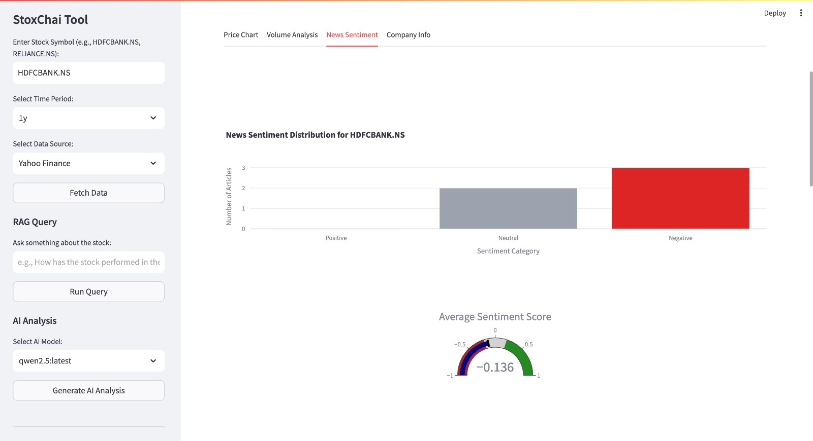

# StoxChai Tool

A comprehensive stock market analysis and AI-powered financial assistant tool that combines data visualization, RAG (Retrieval-Augmented Generation), and AI analysis capabilities.

## Dashboard view


## Sentiment analysis view


## AI analysis view


## Features

- **Dashboard**: Visualize stock data with interactive charts and performance metrics
- **RAG Query**: Ask questions about stocks and get AI-generated answers based on retrieved information
- **AI Analysis**: Get AI-powered analysis of stock performance and trends
- **AI Assistant Chat**: Chat with an AI assistant about stocks and financial topics

## Prerequisites

- Python 3.8 or higher
- [Ollama](https://ollama.ai/) installed and running
- Required Ollama models: llama3, mistral, gemma, phi

## Installation

1. Clone the repository:
   ```
   git clone https://github.com/jaganthoutam/StoxChai.git
   cd StoxChai
   ```

2. Create and activate a virtual environment:
   ```
   python -m venv venv
   source venv/bin/activate  # On Windows: venv\Scripts\activate
   ```

3. Install the required packages:
   ```
   pip install -r requirements.txt
   ```

4. Run the setup script to initialize the application:
   ```
   streamlit run analysis-tool.py
   ```

## Usage

1. Run the application:
   ```
   streamlit run analysis-tool.py
   ```

2. The application will open in your default web browser at http://localhost:8501

3. Enter a stock symbol (e.g., HDFCBANK.NS, RELIANCE.NS) in the sidebar

4. Select the time period and interval for the data

5. Navigate between different pages using the sidebar


## Troubleshooting

### Yahoo Finance API Issues

If you encounter issues with the Yahoo Finance API (e.g., "No price data found" or "429 Client Error: Too Many Requests"), try the following:

1. Wait a few minutes before trying again
2. Use a different stock symbol
3. Try a different time period or interval
4. Check your internet connection

### Torch Issues

If you encounter issues with Torch, try the following:

1. Reinstall Torch:
   ```
   pip uninstall torch
   pip install torch
   ```

2. Set environment variables to disable CUDA:
   ```
   export CUDA_VISIBLE_DEVICES=""
   ```

## License

This project is licensed under the MIT License - see the LICENSE file for details.

## Acknowledgments

- [Streamlit](https://streamlit.io/) for the web application framework
- [Yahoo Finance](https://finance.yahoo.com/) for the stock data
- [Ollama](https://ollama.ai/) for the AI models
- [LangChain](https://langchain.com/) for the RAG implementation 
